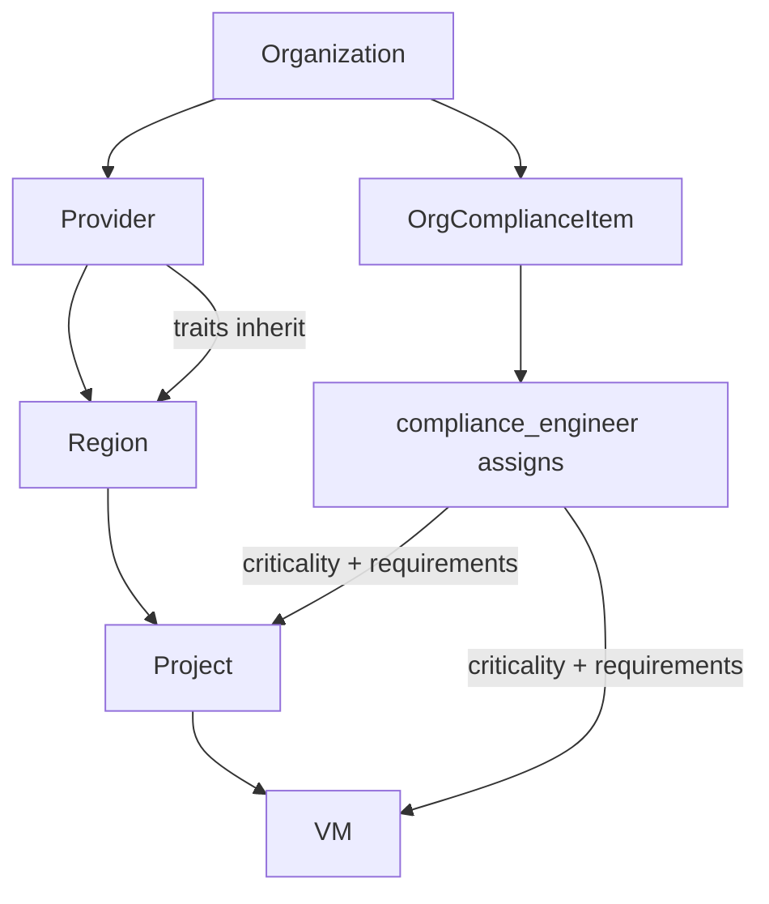
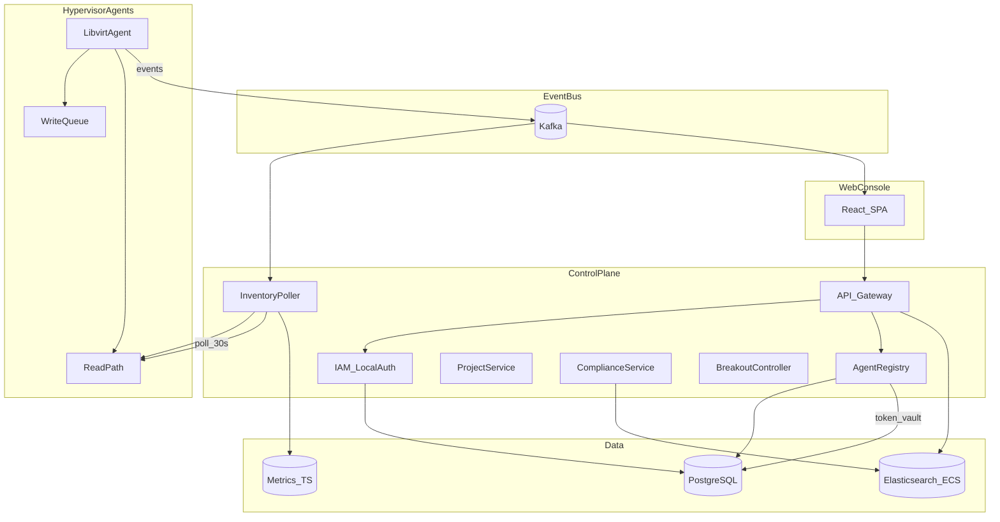
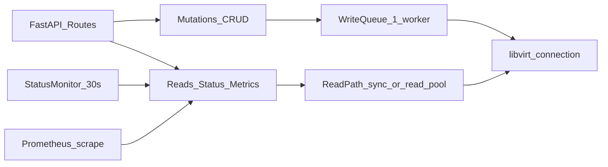
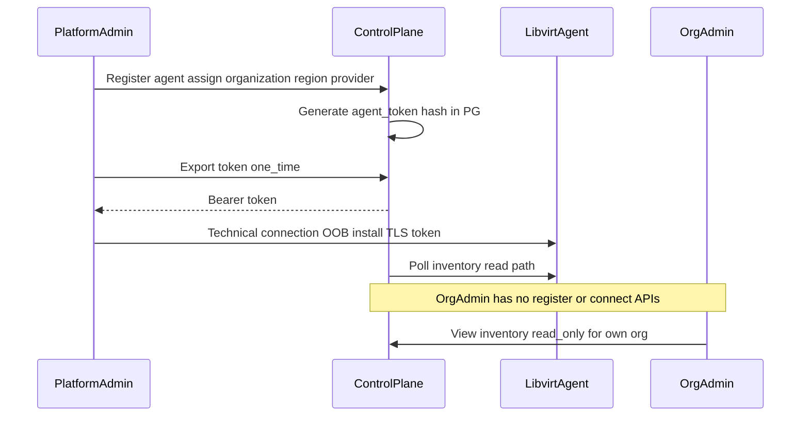
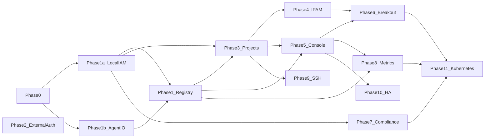

# Huygens platform — phased subprojects (v3)

Canonical delivery roadmap for the monorepo (phases 0–11). For requirements detail see
[FRAMEWORK_PLAN.md](../FRAMEWORK_PLAN.md); for ADRs and diagrams see
[architecture/](architecture/README.md).

Aligned with [FRAMEWORK_PLAN.md](../FRAMEWORK_PLAN.md), [Huygens_Proposal_Strategic.docx](../Huygens_Proposal_Strategic.docx) (**open-source** infra ops platform: *know where workloads run, know why*), and the existing [agents/libvirt](../agents/libvirt/) agent.

**Phase 0:** complete (commit on `main` after `bdf961b`).

---

## Strategic anchor — open source as the link

The strategic proposal and the build plan share one delivery model: **Huygens is an open-source platform** that works with existing infrastructure (agents per hypervisor, control plane services, console). Commercial/support layers are out of scope for this roadmap; the repo itself is the product.

| Strategic promise | Technical expression in phases |
|-------------------|-------------------------------|
| Know **where** workloads run | Phase 1 inventory; provider/region/agent/project; Phase 11 K8s node placement |
| Know **why** | Phase 7: org compliance catalog + **asset criticality** on resources + inherited provider/region traits |
| **Compliant** | Phase 7 checks, owners, validity periods; drift flags from Phase 1 |
| **Who changed** | ECS audit (ES); RBAC including `auditor`, `compliance_engineer` |
| **How connected** | Phase 6 overlay/breakout + topology UI |
| **Audited access** | Phase 9 SSH gateway + session logs to ES |
| **Elastic-correlatable telemetry** | ECS logs; inventory/drift/events Kafka → ES; metrics Phase 8 |
| **Under Kubernetes, not instead of it** | **Phase 11** (crucial) |
| **Open source** | Phase 0: LICENSE, CONTRIBUTING, public API/agent contracts, OSS governance |

---

## Alignment matrix (re-evaluation)

| Area | Strategic doc | FRAMEWORK_PLAN | Phased plan v3 | Gap |
|------|---------------|----------------|----------------|-----|
| Workload inventory | Yes | Via console/agents | Phase 1 + agent | MVP in progress |
| Asset **criticality** | Implied (risk-aware) | **NEW:** `compliance_engineer`, org compliance picker | **Phase 7** | Not in Phases 0–1 |
| Org compliance standards | Yes | Provider/region traits, MoSCoW | Phase 7 | Planned |
| Config drift | Yes (Elastic narrative) | `config_drift` API flag | Phase 1 + 7 UI | Agent/control plane partial |
| Overlay / topology | Yes | WG breakout, drag-and-drop | Phase 6 | Later |
| platform_admin onboarding | — | — | Phase 1 | Documented |
| Open source | **Explicit** | — | **Phase 0** | Was implicit; now explicit |
| Kubernetes | **Explicit section** | — | **Phase 11** | Was missing; now crucial |
| OSS + existing infra | Yes | Agents subdirectory | `agents/` + `services/` | Aligned |
| Ticketing | — | — | Out of scope (SNOW/Jira plugin later) | Aligned |

---

Based on [FRAMEWORK_PLAN.md](../FRAMEWORK_PLAN.md) and your iteration:

| Decision | Choice |
|----------|--------|
| Tenancy | Multi-tenant SaaS |
| Project model | Container for 1+ vnets, VMs, quotas, RBAC |
| Breakout | Hybrid (central mesh + per-hypervisor) |
| Stack | Polyglot microservices |
| **Auth (first)** | **LOCAL only** — LDAP/SAML/OIDC deferred |
| **Agent I/O** | **Write queue** for mutations; **separate read path** for metrics/status/inventory |
| **Inventory refresh** | Default **30s**, configurable, **minimum 10s** |
| **Default libvirt network** | **`readonly: true`** — not deletable in GUI/API for operators |
| **Hypervisor onboarding** | **`platform_admin` only** registers the agent, performs technical connection (token, TLS, install), and **assigns agent to an organization**; org admins never register or connect hypervisors |
| **Agent token** | One token per agent; generated at register; **only `platform_admin` exports** for OOB host provisioning |
| **Events** | **Kafka** (event-driven target); HTTP poll acceptable for Phase 1 MVP |
| **PostgreSQL** | System of record (orgs, projects, desired state, RBAC, registry) |
| **Elasticsearch ECS** | Audit logs, compliance search/views, operator/auditor queries — not primary transactional store |
| MVP | Registry + live status API; operators still use agent Swagger for mutations |
| **Open source** | Entire monorepo OSS; Phase 0 **license ADR** (align Elastic: Apache 2.0 vs AGPLv3 — see below) |
| **Air-gapped install** | No mandatory cloud; offline bundles (containers/Helm/packages); Phase 0 ADR + Phase 10 runbook — **strategic link** alongside OSS self-hosted |
| **Observability** | **OpenTelemetry throughout**, **EDOT-friendly** (FRAMEWORK_PLAN); ECS logs + OTLP to Elastic Observability or any OTLP backend |
| **Asset criticality** | Org-level compliance catalog; `compliance_engineer` assigns criticality/requirements to resources from that catalog (Phase 7) |
| **Know why** | Placement/explainability = inherited provider/region traits + selected org compliance items + asset criticality on VM/project/vnet |

---

## Open-source license — Elastic alignment (Phase 0 ADR)

Elastic does **not use one license for everything**. Huygens should pick deliberately:

| Elastic product line | Typical license | Fit for Huygens? |
|----------------------|-----------------|------------------|
| **Client libraries, Beats, many integrations, OTel distros** | **Apache 2.0** | Strong fit for **agents** and SDKs — permissive, OSI, air-gap friendly, no network copyleft |
| **Elasticsearch + Kibana source (2024+)** | **AGPLv3** (+ ELv2 + SSPL, user chooses) | Aligns with “Elasticsearch is open source again” narrative; **copyleft** implications |
| **Default Elastic Cloud / distribution** | **ELv2** | Not OSI; restricts offering **managed** competing service — poor default for independent multi-tenant Huygens unless product is explicitly Elastic-owned |

**Phase 0 ADR decision (your choice: Apache 2.0 — confirm with Elastic OSPO/Legal before public release):**

1. **Selected: Apache 2.0** for the full Huygens monorepo — aligns with Elastic **client/agent/integration** OSS; permissive; air-gap and multi-tenant friendly; no AGPL network copyleft.
2. **Not default: AGPLv3** — reserved if product positioning shifts to ES/Kibana source sibling (would require legal re-review).
3. **Not default: ELv2** unless Huygens becomes an official Elastic distribution with explicit governance.

**Implications for you as an Elastic employee:**

- Use Elastic **CLA** / contribution process if contributing on company time (OSPO policy).
- **Trademark:** do not imply Elastic endorsement without brand guidelines; repo name `huygens` vs product naming ADR.
- **Dual licensing** (like ES triple license) is possible but increases maintenance — only if legal requests it.
- **Dependencies:** track licenses in `NOTICE`; avoid GPL-incompatible deps if staying Apache 2.0.
- **Air-gapped:** Apache 2.0 and AGPL both allow offline distribution; neither requires Elastic Cloud.

---

## Air-gapped install (strategic + operational link)

Same thread as strategic doc (“self-hosted”, “disconnected environments”) and OSS delivery:

| Requirement | Phase |
|-------------|--------|
| No install-time call-home to Elastic Cloud or Huygens SaaS | 0 ADR, all phases |
| **Offline artifacts:** container images, Helm chart, deb/rpm or tarball, vendored Python wheels | Phase 10 (+ agent from Phase 1b) |
| **Bundled or BYO** dependencies: PostgreSQL, Kafka, Elasticsearch (optional for compliance views) | Documented matrix |
| Agent runs with local `data_dir`, TLS, token — no external deps except libvirt/qemu on host | Existing `agents/libvirt` |
| Control plane **inventory poller** works against internal agent URLs only | Phase 1 |
| Kafka optional; file/DB buffer if broker unavailable (ADR) | Phase 0 / 11 |
| **Install guide:** `docs/install/air-gapped.md` | Phase 10 deliverable |

Phase 11 K8s: document **disconnected clusters** (agents reach control plane via allowed egress only, or store-and-forward).

---

## Elastic integration — Kibana compliance (not SIEM templates)

You have **no opinion on SIEM index templates** — plan does **not** mandate them.

**Instead (Phase 7/8 optional deliverable):** **Huygens Compliance in Kibana**

- Custom **Kibana app / solution node** (or Space + saved objects pack) reading Huygens ECS indices in Elasticsearch
- Surfaces: asset criticality, org compliance items, drift, inherited provider/region traits, audit trail — aligned with `compliance_admin`, `compliance_reader`, `auditor` roles (Kibana RBAC maps to Huygens roles via OIDC later)
- Does **not** require replacing SIEM; complements Security/Observability where customer already runs Elastic Stack in air gap
- **Air-gapped:** dashboard pack importable offline; no Kibana Fleet required for core compliance views

Defer exact implementation (plugin vs integrations app vs Streams) to Phase 7 spike ADR.

---

## Data model — compliance and “know why” (Phase 7)

| Object | Purpose |
|--------|---------|
| `OrgComplianceItem` | Org standard: name, description, URL, MoSCoW, target level (FRAMEWORK_PLAN admin section) |
| Provider / Region `trait` | Qualitative characteristics (sovereignty, BIO, …) — **inherited** by child resources |
| `AssetCriticality` (on VM, project, vnet, …) | Selected from org compliance items by **`compliance_engineer`**; drives “why” and compliance views |
| `ComplianceCheck` | Owner, validity period, annual refresh; audited |

PostgreSQL: authoritative config. Elasticsearch ECS: audit + compliance **search/dashboards** (strategic Elastic narrative).

---

## Architecture — control plane and data stores

---

## Architecture — libvirt agent dual I/O (Excalidraw: `04-agent-dual-io.excalidraw`)

Problem observed in production: a **single serialized libvirt queue** blocked `GET /networks` when the status monitor held the worker on slow `interfaceAddresses` (guest-agent).

| Path | Operations | Rule |
|------|------------|------|
| **Write queue** | `define_*`, `create`, `destroy`, `undefine`, network start/stop | Serialized (default 1 worker); unchanged semantics |
| **Read path** | `list_networks`, `list_domains`, `domain_state`, `domain_xml`, `/metrics` libvirt stats | Must **not** wait behind write queue; use sync calls on read pool or dedicated non-blocking endpoints |
| **Status monitor** | Guest IP via **DHCP lease only** (no blocking guest-agent); poll interval follows org/agent **refresh_seconds** (10–∞) | Runs on read path |

**Phase 1b deliverable (agent):** ADR + implementation in [agents/libvirt](../agents/libvirt/); inventory endpoints documented for control-plane poller.

---

## Architecture — org, agent, and token (see ADR 0005; diagram: `03-tenancy.excalidraw`)

**Onboarding (confirmed):** **`platform_admin`** owns the full hypervisor lifecycle: register in control plane, assign to **customer organization**, export token, install/configure agent on host (out-of-band). **Org admin (`admin`) does not register agents and does not perform technical connection** — they only see agents already linked to their org (inventory, projects, compliance views as RBAC allows).

| Role | Register / connect hypervisor | Export agent token | View org inventory | CRUD VMs |
|------|------------------------------|--------------------|--------------------|----------|
| `platform_admin` | **Yes** | **Yes (only role)** | All orgs | Yes |
| `admin` (org admin) | **No** | No | Own org, read-only inventory | Later via proxy |
| `operator` | No | No | Project-scoped | Later via proxy |

- **Binding:** `platform_admin` sets `organization_id` + `region_id` + `provider_id` at registration time.
- **One token per agent**; rotate/rebind only via `platform_admin`.

---

## Protected resources — libvirt `default` network

| Layer | Behavior |
|-------|----------|
| **Agent** | Networks named `default` (and optionally other system names) expose `readonly: true`, `deletable: false` in API schema |
| **Control plane** | Registry inventory marks `default` readonly; desired-state collector never schedules delete |
| **GUI (Phase 5+)** | No delete button; greyed card with tooltip "system network" |
| **Operators** | Create project vnets via IPAM (`lab0`, etc.); do not manage host `default` through console |

---

## Event-driven model (Kafka)

| Phase | Mechanism |
|-------|-----------|
| **0** | Topic contracts: `huy.agent.events`, `huy.inventory.snapshots`, `huy.audit.events`; Avro/JSON schema in repo |
| **1 MVP** | Control-plane **InventoryPoller** HTTP-calls agent read endpoints every `refresh_seconds` (default 30, min 10); optional publish snapshot to Kafka |
| **1+** | Agent publishes CloudEvents to Kafka (VM created, status changed, network changed) |
| **5** | Console consumes Kafka for "instant" UI updates; poller remains backstop |

PostgreSQL holds **latest snapshot** per agent; Kafka holds **event stream** for UI and audit pipeline.

---

## Data store responsibilities

| Store | Holds | Does not hold |
|-------|--------|----------------|
| **PostgreSQL** | Orgs, users (local auth), roles, providers/regions/agents, projects, desired state, agent token **hash**, refresh config, IPAM allocations | Full audit history at scale |
| **Elasticsearch (ECS)** | Audit trail, compliance search views, session/SSH logs later, dashboard queries for `auditor` / `compliance_admin` | Authoritative RBAC or billing |
| **Metrics TS** (Prometheus or ES data stream) | Scraped `/metrics`, aggregated for graphs | — |

Compliance **configuration** in PostgreSQL; compliance **reports and log views** in Elasticsearch.

---

## Excalidraw deliverables (Phase 0)

Under [architecture/diagrams/](architecture/diagrams/). Regenerate with `python3 scripts/generate-excalidraw-diagrams.py`.

| File | Contents |
|------|----------|
| `01-system-context.excalidraw` | Tenants, console, control plane, agents, PG/ES/Kafka |
| `02-deployment.excalidraw` | Hypervisor host vs control-plane cluster |
| `03-tenancy.excalidraw` | Org → provider → region → agent; project → vnet/VM |
| `04-agent-dual-io.excalidraw` | Write queue vs read path |
| `05-event-flow.excalidraw` | Kafka topics and consumers |
| `06-phase-roadmap.excalidraw` | Delivery phases 0–11 |
| `07-air-gapped.excalidraw` | Offline / customer-network topology |

---

## Phased deliverables (revised order)

### Phase 0 — Platform foundation + open source ✅
- **OSS:** **Apache 2.0** LICENSE (OSPO/Legal sign-off), `CONTRIBUTING.md`, `CODE_OF_CONDUCT.md`, `NOTICE`, public README linking to strategic narrative
- **Air-gapped ADR:** offline install topology, BYO vs bundled deps, no mandatory cloud
- Monorepo: `services/`, `web/`, `agents/`, `docs/architecture/` — all OSS-published
- Tenancy ERD: `Organization` → `Project` → `VNet` / `VM`; stub `OrgComplianceItem` + `AssetCriticality` in ERD for Phase 7
- ADRs: dual libvirt I/O, token vault, PG vs ES, Kafka topics, readonly system networks, **OSS governance**, **know-why data model**, **OTel/EDOT standards** (resource attributes, OTLP, log correlation)
- Excalidraw set (7 files) — see table above
- **Deliverable:** ADR pack + OSS-ready repo + diagrams + Kafka topic schemas + service scaffolds — **done**

### Phase 1a — Local IAM (before registry UI) ✅
- **LOCAL** authentication only (username/password or API key; no OIDC/LDAP/SAML yet)
- Built-in roles per [FRAMEWORK_PLAN.md](../FRAMEWORK_PLAN.md): `admin`, `compliance_admin`, **`platform_admin`**, **`compliance_engineer`** (stub; full criticality APIs in Phase 7), project roles (stub assignments OK)
- Multi-tenant org isolation
- **Deliverable:** Login API + JWT/session; RBAC middleware; `platform_admin` role assignable — **done** (`services/iam`)

### Phase 1b — Agent dual I/O (parallel) ✅
- Write queue for mutations; read path for list/state/metrics
- Status monitor on read path; DHCP-lease IP only; interval aligned to poll config
- API: `GET /api/v1/networks` includes `readonly` / `deletable` flags; `default` is readonly
- **Deliverable:** Merged agent release; no list-networks hang under load — **done** (`agents/libvirt`)

### Phase 1 — Agent registry and inventory (MVP)
- **`platform_admin` only:** CRUD **provider → region → agent**, assign agent to **organization**, technical connection workflow (export token, connection status)
- Org `admin`: **read** agents/inventory for their org only — no register/connect APIs
- Agent enrollment stores token hash; **token export: `platform_admin` only**
- InventoryPoller: `refresh_seconds` per agent or org default (**30**, min **10**)
- Poll via read path: `/api/v1/agent`, `/api/v1/vms`, `/api/v1/networks`, `/metrics`
- Desired vs actual in PostgreSQL; `detected.config_drift` on resources
- Publish inventory snapshots to Kafka (optional in 1.0, required before Phase 5)
- **Deliverable:** 2+ agents registered per org; dashboard API shows inventory; mutations still via agent Swagger

### Phase 2 — External authentication (deferred)
- LDAP, SAML, OIDC adapters behind same RBAC
- **Deliverable:** Enterprise login; local auth remains for break-glass

### Phase 3 — Project service and agent proxy
- Project CRUD; proxy operator CRUD to agents
- Enforce readonly networks in proxy (reject delete on `default`)
- **Deliverable:** Single control-plane API for operators

### Phase 4 — IPAM and subnet wizard
- RFC1918 pool, wizard, allocation to vnets
- **Deliverable:** No ad-hoc CIDRs on create

### Phase 5 — Web console + Kafka live updates
- SPA: org-scoped views; no delete on readonly networks
- Kafka consumer for status/events; poller as fallback
- **Deliverable:** Operators use console only

### Phase 6 — Hybrid breakout and network linking
- Central `breakout-controller` + per-agent breakout
- Drag-and-drop linking (UI)
- **Deliverable:** Cross-hypervisor link visible in UI

### Phase 7 — Compliance, asset criticality, and “know why”
- **Org compliance catalog:** standards with description, URL, MoSCoW, org target level (FRAMEWORK_PLAN)
- **Provider / region traits** with inheritance to projects/VMs
- **`compliance_engineer` role:** assign **asset criticality** and compliance requirements on resources by **selecting from org compliance items** (not free-text only)
- **Compliance checks:** owner, validity period, annual refresh; all changes audited → ES ECS
- **Compliance alerter** (FRAMEWORK_PLAN)
- Console: drift badge + criticality badge + inherited traits (“why this workload is here” panel)
- **Explainability API:** `GET /resources/{id}/placement-rationale` (inherited traits + criticality + checks)
- **Kibana (optional pack):** compliance app/node — dashboards over Huygens ECS data (no mandatory SIEM index templates)
- **Deliverable:** Compliance dashboard; ES views for `compliance_admin`, `compliance_reader`, `auditor`; explainability API; Kibana compliance pack spike

### Phase 8 — Observability, EDOT, and graphs
- **OpenTelemetry throughout** all control-plane services (traces, metrics, logs) per FRAMEWORK_PLAN
- **EDOT-friendly:** standard OTLP export; document pairing with [Elastic Distribution of OpenTelemetry](https://www.elastic.co/docs/reference/opentelemetry) (EDOT Collector → Elasticsearch/Kibana APM/Observability); no Elastic-proprietary agent lock-in
- Shared resource attributes: `service.name`, `huy.org.id`, `huy.agent.id`, `huy.project.id` (align with existing agent `huy.agent.*` labels on libvirt agent)
- structlog → ECS JSON logs; trace/log correlation (`trace_id` in ECS)
- Scrape Prometheus `/metrics` from agents via read path; 30s (min 10s) alignment
- VM and hypervisor charts in console + Elastic Observability when EDOT stack present
- **Deliverable:** OTel on all services; EDOT integration guide; graphs in UI

### Phase 9 — SSH gateway
- `ssh_access` role; session recording; audit to ES
- **Deliverable:** Recorded sessions searchable in ES

### Phase 10 — Hardening, air-gapped, and scale
- HA control plane, Kafka cluster ops, secrets rotation for agent tokens
- **`docs/install/air-gapped.md`:** offline images, Helm, config matrix (PG/Kafka/ES BYO), verification checklist
- **Deliverable:** Production + air-gapped runbooks

### Phase 11 — Kubernetes awareness (crucial — strategic alignment)
*Addresses strategic doc: “underneath and alongside Kubernetes.”*

- **Not** a Kubernetes distribution or cluster scheduler replacement
- **Inventory:** K8s nodes → map to provider/region/agent (where nodes run)
- **Clusters** as first-class resources linked to projects; jurisdiction/sovereignty via region traits
- **Overlay governance:** correlate cluster CNI/overlay with Huygens vnet/breakout topology (Phase 6 integration)
- **Disconnected / edge clusters:** document agent connectivity model (store-and-forward or polled agents) in ADR
- **Audit:** cluster-scoped infra changes feed Kafka → ES ECS (same pipeline as VM events)
- Optional later: `agents/k8s` observer agent (read-only) — polyglot per bounded context
- **Disconnected clusters:** ADR for reachability (air-gapped / one-way) — same install model as hypervisor agents
- **Deliverable:** Console shows cluster ↔ hypervisor ↔ region; answers strategic K8s bullet list at infra layer

---

## Build order

**MVP critical path:** Phase 0 → 1a + 1b (parallel) → Phase 1.

**Strategic completeness path:** Phases 0–10 deliver FRAMEWORK_PLAN + OSS platform; **Phase 11 closes gap with strategic K8s narrative.**

---

## Service map (updated)

| Service | Stack | Notes |
|---------|-------|--------|
| `iam` | Python | **Local auth first**; issues JWT; RBAC |
| `registry` | Python | Agents, token vault, enrollment |
| `inventory` | Python | Poller + Kafka producer; uses agent **read path** |
| `audit-ingest` | Python/Logstash | Writes ECS to Elasticsearch |
| `projects` | Python | Proxy + quotas |
| `compliance` | Python | Org catalog, asset criticality, traits, checks; PG + ES views |
| `breakout-controller` | Go | Central WG |
| `api-gateway` | Go/Kong | Auth, routing |
| `web` | React/TS | Readonly network UX |
| `agents/libvirt` | Python | Write queue + read path |

---

## Risks and mitigations

| Risk | Mitigation |
|------|------------|
| Libvirt read/write contention | Dual I/O ADR; never route GET/list/metrics through write queue |
| Token leakage | Hash at rest; only `platform_admin` registers/connects; export API/CLI platform_admin-only; OOB provisioning |
| Polling load | 30s default, min 10s; batch read endpoints where possible |
| Kafka scope creep | Phase 1: schemas + optional publish; full UI consumption in Phase 5 |

---

## Deferred / out of scope for near phases

- LDAP, SAML, OIDC (Phase 2)
- Drag-and-drop network graph (Phase 6)
- SSH gateway (Phase 9)
- Multi-region control-plane HA (Phase 10)
- **Ticketing** — SNOW/Jira plugin only if needed later
- **Asset criticality UI** — Phase 7 (role exists in FRAMEWORK_PLAN from day one in IAM stubs only)
- **Kubernetes** — Phase 11 (not deferred indefinitely; **crucial** after core platform)

---

## Clarifications captured (no further action unless you disagree)

1. **`platform_admin`** registers the hypervisor, assigns it to a customer org, exports the token, and performs **technical connection** OOB. **Org admin** never registers or connects; they only consume inventory for their org.
2. **`default` libvirt network** is system readonly at agent, API, and GUI layers.
3. **Real-time** in MVP means poller-driven snapshots (30s default), not sub-second streaming; Kafka enables faster UI in Phase 5.
4. **Compliance transactional data** in PostgreSQL; **searchable audit/compliance views** in Elasticsearch ECS.
5. **Open source** is the delivery model for the whole monorepo (Phase 0), matching the strategic proposal.
6. **`compliance_engineer`** maps org compliance items to per-resource **asset criticality** (Phase 7) — core to “know why.”
7. **Phase 11 Kubernetes** is required for close alignment with the strategic document, not optional future work.
8. **License:** **Apache 2.0** (chosen); OSPO/Legal sign-off before public launch.
9. **Air-gapped install** is a first-class deliverable (Phase 0 ADR + Phase 10 docs), not an afterthought.
10. **Kibana compliance node** replaces “SIEM index templates” as the Elastic UX integration path (Phase 7/8 optional pack).
11. **OTel + EDOT-friendly** across platform (Phase 0 ADR, Phase 8 full rollout; agent has partial OTel today).
