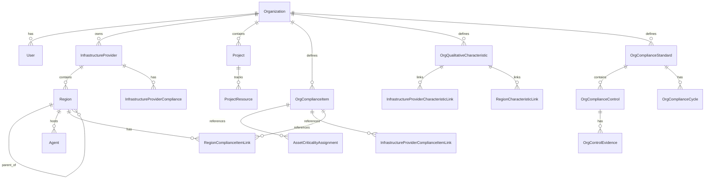

# Tenancy and resource model

## Hierarchy

GRC tables (`OrgComplianceStandard`, controls, cycles, evidence, packs) live in the same PostgreSQL database as placement catalog items; see [compliance/README.md](../../compliance/README.md).

Regions form a **tree** (`parent_region_id`). Compliance standards on a parent region apply to agents placed in descendant regions.

## Entities

| Entity | Scope | Notes |
|--------|--------|--------|
| **Organization** | Tenant | Customer boundary; all RBAC scoped here |
| **InfrastructureProvider** | Platform | e.g. Hetzner — provider-level compliance catalog links |
| **Region** | Provider | Hierarchical (datacenter → rack → …); region-level catalog links inherit down |
| **Agent** | Region + Org | Hypervisor agent; `platform_admin` registers and connects |
| **Project** | Org | Container for vnets, VMs, quotas, RBAC |
| **ProjectResource** | Project + Agent | Exclusive assignment of vm / network / cloud_init by name |
| **OrgComplianceItem** | Org | Placement catalog (MoSCoW, URL, description) — Explorer + criticality |
| **OrgQualitativeCharacteristic** | Org | Placement labels (MoSCoW, description); linked on provider/region |
| **OrgComplianceStandard** / **Control** / **Cycle** | Org | GRC framework (audit-ready); separate from placement catalog slugs |
| **OrgControlEvidence** | Control + cycle | Metadata in PG; file bytes in object store |
| **AssetCriticalityAssignment** | Resource | Direct links from VM/vnet/project to **catalog** items |
| **Project aggregate** | Derived | Not stored — catalog items where all child VMs/networks comply |

## Compliance membership (runtime)

| Kind | Meaning |
|------|---------|
| Direct | Explicit assignment on the resource |
| Placement inherited | Provider/region **catalog** standards and **qualitative characteristics** (ancestor regions) |
| Project aggregate | Intersection of effective compliance across all project VMs and networks |

## Desired vs actual state

Every managed resource stores:

- `desired_state` — JSON document (last applied intent)
- `actual_state` — JSON from agent inventory poll or event
- `detected.config_drift` — boolean, computed diff (placement rationale field reserved; not yet wired)

PostgreSQL holds authoritative desired state and latest snapshot; Kafka holds change events.

## Roles (summary)

| Role | Scope |
|------|--------|
| `platform_admin` | Cross-org; register/connect agents; export tokens |
| `admin` | Org admin; read inventory; infrastructure compliance |
| `compliance_engineer` | Assign asset criticality from org catalog |
| `compliance_admin` | Org compliance checks and infrastructure standards |
| `compliance_reader` | Read compliance surfaces |
| Project roles | `project_admin`, `operator`, `auditor`, … per FRAMEWORK_PLAN |

## Lifecycle guards (projects service)

| Action | Blocked when |
|--------|----------------|
| Delete network | VMs attached, topology link active, or breakout enabled |
| Delete IP pool | Subnet assignments exist or overlay links reference pool |

See [operations/phase7-compliance-and-lifecycle-guards.md](../../operations/phase7-compliance-and-lifecycle-guards.md).
