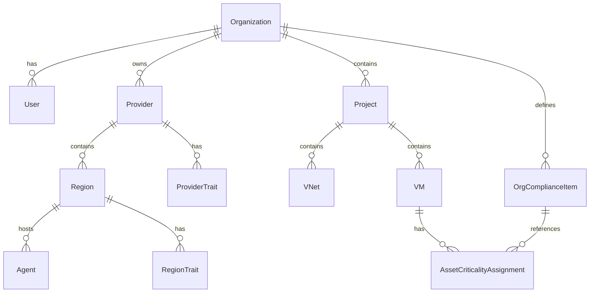

# Tenancy and resource model

## Hierarchy

## Entities

| Entity | Scope | Notes |
|--------|--------|--------|
| **Organization** | Tenant | Customer boundary; all RBAC scoped here |
| **Provider** | Org | e.g. Hetzner, Azure — leading for compliance traits |
| **Region** | Provider | e.g. `hetzner-de`, `azure-germany` — inherits + adds traits |
| **Agent** | Region + Org | Hypervisor agent; `platform_admin` registers and connects |
| **Project** | Org | Container for 1+ vnets, VMs, quotas, RBAC |
| **VNet** | Project | Libvirt network; CIDR from IPAM (Phase 4) |
| **VM** | Project | Workload on an agent |
| **OrgComplianceItem** | Org | Standard catalog (MoSCoW, URL, description) |
| **AssetCriticalityAssignment** | Resource | Links VM/vnet/project to org compliance items |

## Desired vs actual state

Every managed resource stores:

- `desired_state` — JSON document (last applied intent)
- `actual_state` — JSON from agent inventory poll or event
- `detected.config_drift` — boolean, computed diff

PostgreSQL holds authoritative desired state and latest snapshot; Kafka holds change events.

## Roles (summary)

| Role | Scope |
|------|--------|
| `platform_admin` | Cross-org; register/connect agents; export tokens |
| `admin` | Org admin; read inventory; no agent connect |
| `compliance_engineer` | Assign asset criticality from org catalog |
| Project roles | `project_admin`, `operator`, `auditor`, … per FRAMEWORK_PLAN |
